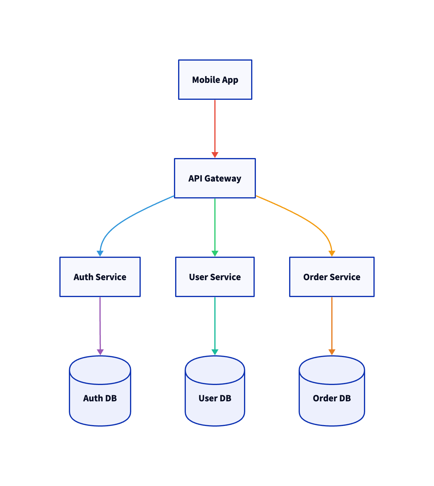
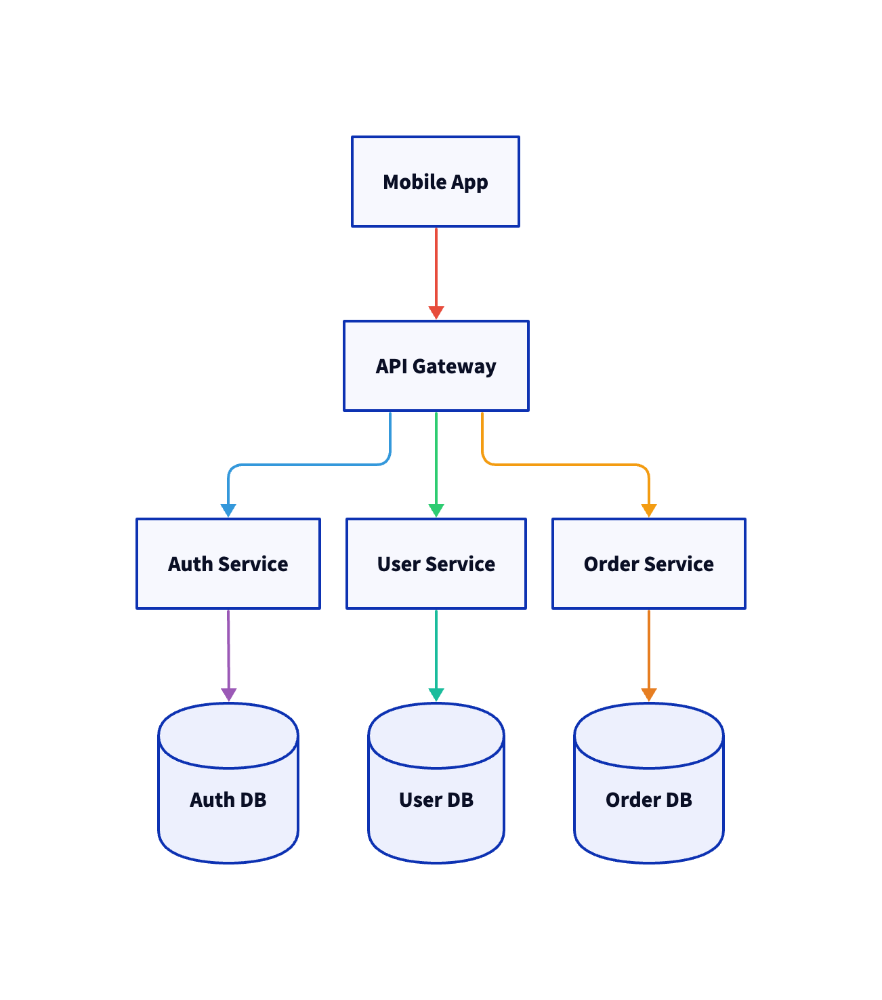
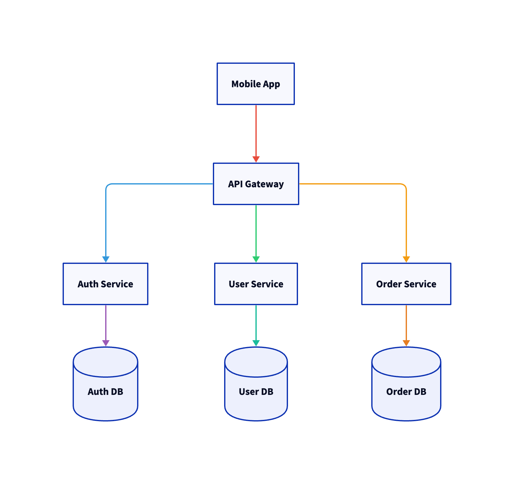
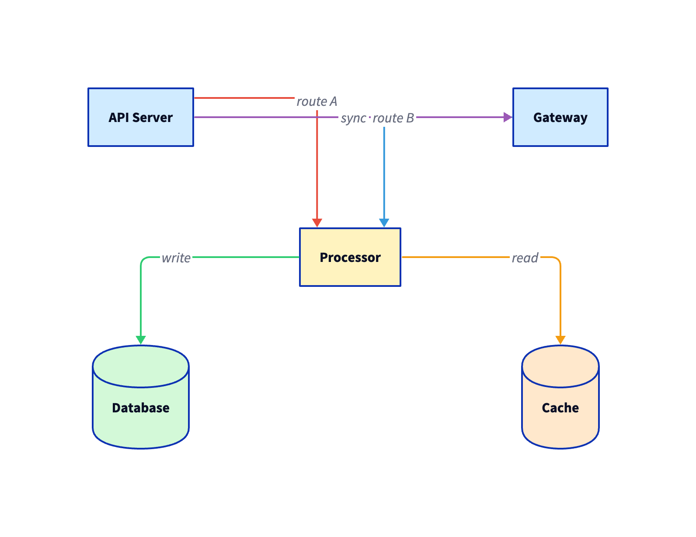
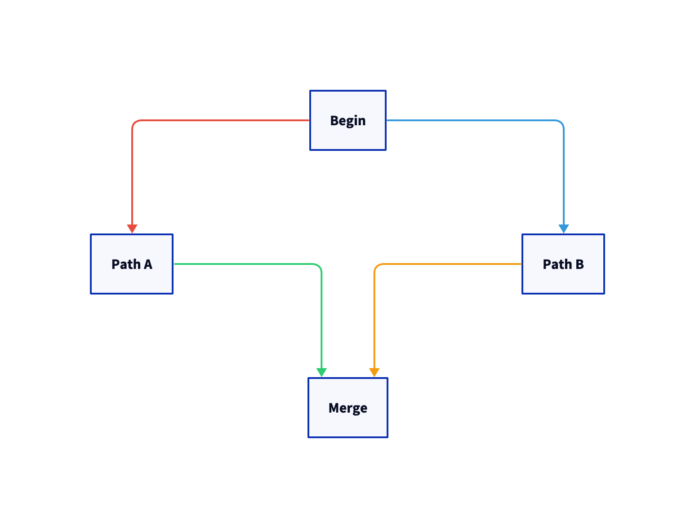
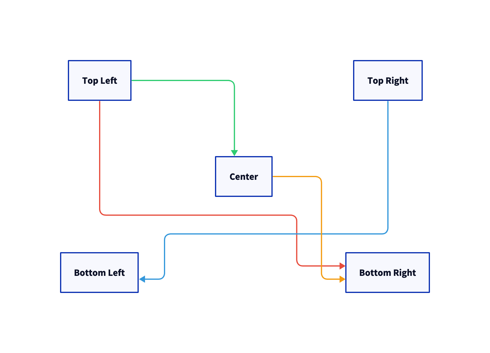
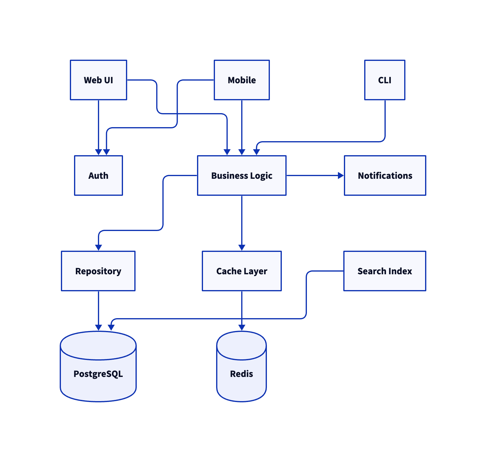

# D2 Octopus Layout Engine

An external layout engine plugin for [D2](https://d2lang.com) that gives you explicit grid based control over node placement and intelligent A* edge routing.

## Why Octopus?

D2 ships with several built in layout engines. Each takes a different approach to automatic node placement:

| Engine | Type | Approach |
|--------|------|----------|
| **dagre** (default) | Hierarchical | Auto places nodes in layers based on edge direction. Good for top down flows but you cannot control exact positions. |
| **elk** | Hierarchical | Eclipse Layout Kernel. More layout options than dagre but still automatic placement. Requires Java. |
| **tala** | Proprietary | Terrastruct's commercial engine. Produces clean layouts automatically but is closed source and requires a license. |
| **Octopus** | Grid based | **You decide where every node goes.** Assign grid coordinates, Octopus handles the pixel math and edge routing. |

### Comparison

The same microservices diagram rendered with each engine:

| dagre | elk | Octopus |
|-------|-----|---------|
|  |  |  |

All three engines receive the same D2 file. dagre and elk decide placement automatically. Octopus places nodes exactly where the grid coordinates specify, producing a consistent, predictable layout every time.

### When to use Octopus

- Architecture diagrams where component placement matters (layers, zones, regions)
- Infrastructure maps with specific topology (rows of services, columns of environments)
- Any diagram where automatic layout engines produce unpredictable or undesirable arrangements
- Diagrams that need to look the same every time they render, regardless of engine version changes

### When to use a built in engine

- You want the engine to figure out the best arrangement automatically
- Your diagram changes frequently and manual positioning is not practical
- You do not care about exact node placement, only the relationships

## Installation

### Prerequisites

- [Go](https://go.dev/dl/) 1.21 or later
- [D2](https://d2lang.com/tour/install) 0.7 or later

### Install with Go

```bash
go install github.com/valllabh/d2-octopus-layout-engine/cmd/d2plugin-octopus@latest
```

### Or Build from Source

```bash
git clone https://github.com/valllabh/d2-octopus-layout-engine.git
cd d2-octopus-layout-engine
make install
```

### Verify the Plugin is Available

D2 automatically discovers layout engine plugins by looking for binaries named `d2plugin-*` in your `$PATH`. After installing, verify D2 can find it:

```bash
d2 --layout=octopus tests/input/07-diamond-pattern.d2 output.svg
```

If you get `unknown layout engine`, make sure `$GOPATH/bin` is in your `$PATH`:

```bash
export PATH="$PATH:$(go env GOPATH)/bin"
```

Add this to your shell profile (`~/.zshrc` or `~/.bashrc`) to make it permanent.

## Quick Start

### Step 1: Create a D2 file

Every node gets a grid position using `row-N-col-M` classes. Rows go top to bottom, columns go left to right, both starting at 1.

```d2
# Define the grid position classes
classes: {
  row-1-col-1: {style.opacity: 1}
  row-1-col-2: {style.opacity: 1}
  row-2-col-1: {style.opacity: 1}
  row-2-col-2: {style.opacity: 1}
}

# Place nodes on the grid
api: API Server {class: row-1-col-1}
db: Database {class: row-1-col-2}
cache: Cache {class: row-2-col-1}
worker: Worker {class: row-2-col-2}

# Define connections (Octopus routes them automatically)
api -> db
api -> cache
cache -> worker
```

### Step 2: Render

```bash
d2 --layout=octopus diagram.d2 output.svg
```

Or render to PNG:

```bash
d2 --layout=octopus diagram.d2 output.png
```

### Step 3: Customize (optional)

Adjust grid sizing with plugin flags:

```bash
d2 --layout=octopus \
  --octopus-cell-width=250 \
  --octopus-cell-height=150 \
  --octopus-gap=60 \
  diagram.d2 output.svg
```

Nodes without grid classes are auto placed in the next available cell.

## Edge Anchor Control

Control exactly where edges connect to shapes using anchor classes. Each shape edge has 5 anchor points (1 through 5) plus corners and edge centers.

```d2
classes: {
  src-anchor-bottom-2: {style.opacity: 1}
  dst-anchor-top-4: {style.opacity: 1}
}

a -> b: {
  class: src-anchor-bottom-2
  class: dst-anchor-top-4
}
```



**Important**: use separate `class:` lines for multiple classes on edges. D2 does not split space separated class values.

Available anchors: `top-1` through `top-5`, `bottom-1` through `bottom-5`, `left-1` through `left-5`, `right-1` through `right-5`, plus `top-center`, `bottom-center`, `left-center`, `right-center`, `top-left`, `top-right`, `bottom-left`, `bottom-right`, `center`.

## More Examples

| Diamond pattern | Diagonal connections | Layered architecture |
|-----------------|---------------------|---------------------|
|  |  |  |

See `tests/input/` for all 32 test diagrams.

## Plugin Flags

| Flag | Default | Description |
|------|---------|-------------|
| `octopus-cell-width` | 200 | Cell width in pixels |
| `octopus-cell-height` | 120 | Cell height in pixels |
| `octopus-gap` | 40 | Gap between cells |
| `octopus-padding` | 60 | Padding around the grid |
| `octopus-align` | center | Default cell alignment |
| `octopus-anchor` | center | Default shape anchor |

## How Edge Routing Works

Octopus includes a custom A* pathfinder optimized for grid layouts:

1. **Side selection**: picks exit/entry sides based on relative node positions and obstacle scoring
2. **Anchor distribution**: edges sharing a node side get spread across 5 anchor slots automatically
3. **A* pathfinding**: routes through a sparse grid of gap channel sub lanes with direction aware state, penalizing bends, crossings, and parallel overlaps
4. **Straight line optimization**: same row or same column edges use direct paths when unobstructed
5. **Proportional overlap spreading**: when multiple edges share a gap channel, they get evenly distributed across the actual gap between adjacent shapes

## Build and Test

```bash
make build          # compile to bin/d2plugin-octopus
make test           # run all tests
make lint           # go vet
make install        # copy binary to $GOPATH/bin
make render         # render all test diagrams (SVG + PNG)
make clean          # remove bin/
```

## Project Structure

```
cmd/d2plugin-octopus/     -- entry point
internal/plugin/          -- layout pipeline, A* router
internal/grid/            -- grid coordinates, anchors, pixel math
tests/
  input/                  -- 32 test D2 diagrams
docs/
  images/                 -- comparison and example images
```

## License

MIT License. See [LICENSE](LICENSE).
